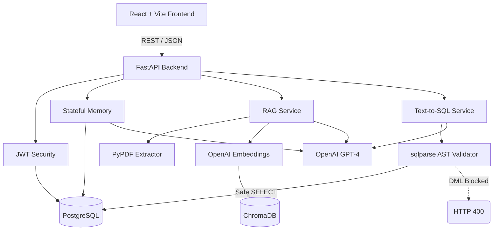

# Enterprise Knowledge & Analytics Assistant


An enterprise-grade, conversational AI assistant designed to unify internal document search (RAG) and relational data analytics (Text-to-SQL) into a single, intuitive interface. Built with a focus on strict security, data isolation, and architectural cleanliness.

---

## 🌟 Features

- **Conversational RAG**: Upload PDF documents and query them contextually. The AI maintains session memory and cites the exact source document and page number to prevent hallucination.
- **Safe Text-to-SQL Analytics**: Ask natural language questions about business data (e.g., *"What is the total revenue by region?"*). The system translates this to PostgreSQL, validates the Abstract Syntax Tree (AST) to prevent destructive queries (e.g., `DROP`), executes the query, and generates an executive summary.
- **Dynamic Visualization**: The React frontend dynamically binds unpredictable SQL JSON output to Recharts, rendering beautiful bar charts, line charts, and KPI cards on the fly.
- **Stateless AI Architecture**: Chat memory is persisted in PostgreSQL rather than server RAM, allowing for horizontal scalability across multiple backend nodes.
- **Multi-Tenant Security**: Vector searches in ChromaDB are strictly filtered by JWT `user_id` to guarantee tenant data isolation.

---

## 🏗 Architecture



---

## 🛠 Tech Stack

**Backend**
- Python 3.10+, FastAPI, Uvicorn
- SQLAlchemy, Alembic (Migrations)
- LangChain, OpenAI, PyPDF
- sqlparse (Security)

**Database**
- PostgreSQL 15 (Relational Data & Memory)
- ChromaDB (Vector Store)

**Frontend**
- React 18, TypeScript, Vite
- Tailwind CSS (Glassmorphism & Dark Mode)
- Recharts (Dynamic Analytics)
- Axios, React Router

---

## 🚀 Installation & Setup

### Prerequisites
- Docker and Docker Compose
- Node.js (v18+)
- OpenAI API Key

### 1. Backend Setup (Docker)
Clone the repository and set up your environment variables.
```bash
cd backend
cp .env.example .env
# Edit .env and insert your OPENAI_API_KEY
```

Boot the backend using Docker Compose. This will spin up the FastAPI server and a PostgreSQL container.
```bash
docker-compose up -d --build
```

The database will automatically seed with a demo user and mock sales analytics data.
- **Swagger API Docs**: http://localhost:8000/docs

### 2. Frontend Setup
In a new terminal, navigate to the frontend directory.
```bash
cd frontend
npm install
npm run dev
```
- **App URL**: http://localhost:3000

---

## 📂 Folder Structure

```text
.
├── backend/
│   ├── alembic/              # Database migrations
│   ├── app/
│   │   ├── api/              # FastAPI routers (auth, chat, documents, search, sql)
│   │   ├── core/             # Configuration, Database Setup, Security
│   │   ├── models/           # SQLAlchemy ORM Models
│   │   ├── repositories/     # Generic Repository Pattern (CRUDBase)
│   │   ├── schemas/          # Pydantic validation schemas
│   │   └── services/         # Core AI Business Logic (RAG, Text-to-SQL)
│   ├── Dockerfile
│   └── requirements.txt
├── frontend/
│   ├── src/
│   │   ├── components/       # Reusable React components (DynamicChart)
│   │   ├── pages/            # Dashboard and Chat Views
│   │   └── services/         # Axios API client with interceptors
│   ├── tailwind.config.js
│   └── vite.config.ts
├── docker-compose.yml
└── README.md
```

---

## 🔒 Security Posture

1. **Password Hashing**: Passwords are one-way hashed using `bcrypt` before database insertion.
2. **Stateless JWT**: Sessions are managed via stateless JSON Web Tokens.
3. **AST SQL Validation**: Generated SQL is converted to an Abstract Syntax Tree using `sqlparse`. The tree is walked to ensure no `DROP`, `DELETE`, `UPDATE`, or `INSERT` tokens exist before execution.
4. **Vector Isolation**: ChromaDB queries strictly inject `{"user_id": current_user.id}` into the `where` filter to prevent cross-tenant data spillage.

---

## 📄 License
This project is licensed under the MIT License.
